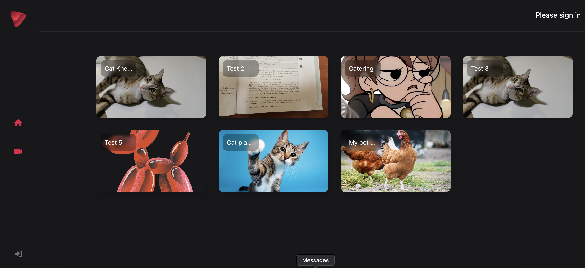
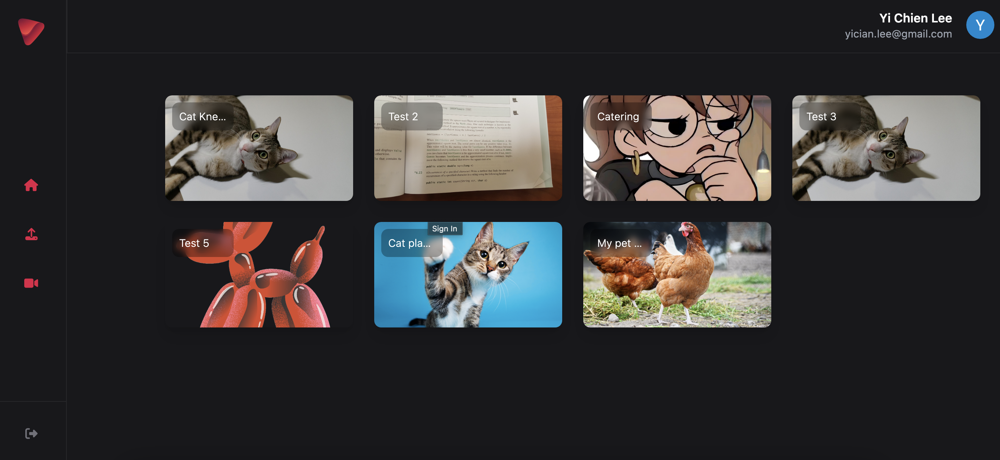
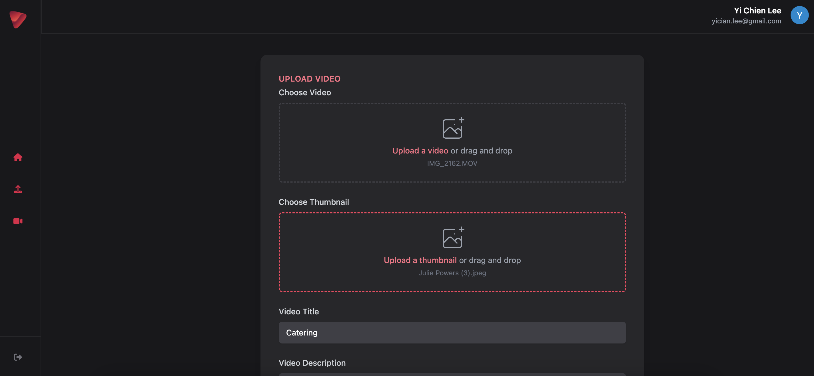
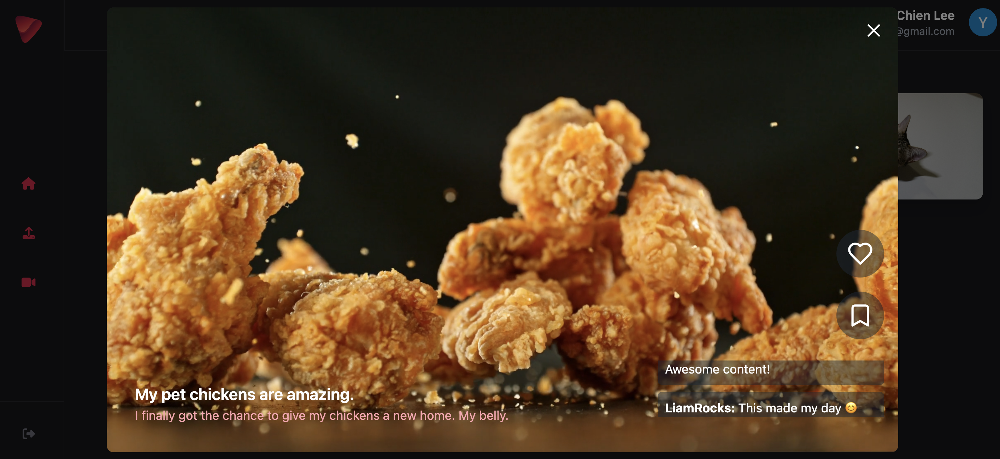

# Youtube Clone Summry 

Link for [Youtube Clone](https://yt-web-client-815323102848.us-central1.run.app/).

This project aims to create a simplified version of a video-sharing platform, inspired by YouTube. While we won't be replicating all of YouTube's features, we'll focus on implementing the essential functions that define such a platform.

# Screenshot
## As a Visitor

    

## As a User

    
    
    
    

# Technologies Used
- Javascript (Next.js, Express.js), Typescript
- CSS (Tailwind)
- FFmpeg
- Docker
- Google Cloud (Storage, Pub/Sub, Run)
- Firebase (Auth, Functions, Firestore)

# Project

# Next Steps
Planned future enhancements:

 - [ ] Add user's profile picture and email to Web Client
 - [x] (Bug fix) Allow users to upload multiple videos without refreshing the page
  - [x] Allow users to upload thumbnails for their videos
  - [x] Allow user's to add a title and description to their videos
  - [x] Show the uploader of a video
  - [ ] Allow user's to subscribe to other user's channels
  - [ ] Clean up raw videos in Cloud Storage after processing
  - [ ] Use a CDN to serve videos
  - [ ] Add unit and integration tests
